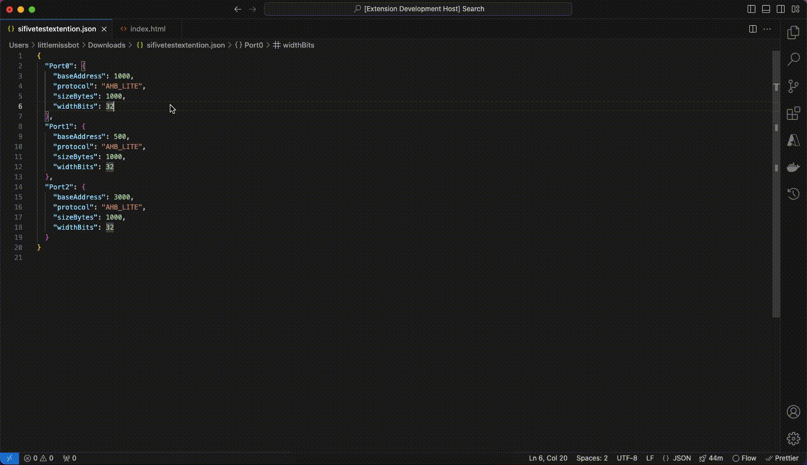

# vsext-jsonvalidation

The `vsext-jsonvalidation` extension is designed to validate JSON and JSON5 files in Visual Studio Code, ensuring proper formatting, schema validation, and detecting any overlaps in address ranges.



## Features

- **JSON Validation**: Automatically checks if the JSON file is valid when you run the "SiFive Test" command.
- **Schema Validation**: Verifies that the JSON objects have required fields: `baseAddress`, `protocol`, `sizeBytes`, and `widthBits`.
- **Overlap Detection**: Detects overlaps in address ranges between different ports within a JSON object.

You can access these features by right-clicking on a JSON or JSON5 file in the editor and selecting the "SiFive Test" option from the context menu.

## Requirements

This extension requires the following dependencies:

- **Visual Studio Code** version 1.94.0 or later
- **Node.js** version 14.x or later
- **TypeScript** version 4.7.4 or later

Install these dependencies before running or testing the extension.

## Installation and Setup

1. **Clone the repository** or download the extension.
2. **Install dependencies**:
   ```bash
   npm install
   ```
3. **Compile the extension**:
   ```bash
   npm run compile
   ```

## How to Run the Extension

To run the extension in Visual Studio Code:

1. Open the project in VS Code.
2. Press `F5` to launch the extension in a new VS Code window.
3. Open any `.json` or `.json5` file.
4. Right-click and choose **SiFive Test** from the context menu. This will trigger JSON validation, schema checking, and overlap detection.

## How to Run the Tests

To run the test suite for the extension, execute:

```bash
npm test
```

This will use Mocha to run the tests defined in `extension.test.ts`. The tests include validation of JSON formatting, schema checks, and overlap detection.

## Explanation of the Tests

The test suite includes **unit tests** for the main features of the extension:

- **JSON Validity**: Ensures that the extension detects invalid JSON files.
- **Schema Validation**: Tests whether the JSON objects follow the required schema with the expected fields.
- **Overlap Detection**: Verifies if the extension correctly identifies overlapping address ranges in JSON files.

The tests are located in the `extension.test.ts` file and executed using Mocha, with assertions provided by Node's `assert` module.

## Logic and Architecture

### Main Components

1. **`activate` Function**: Registers the command `vsext-jsonvalidation.validateJson` that validates JSON files. The command is triggered by right-clicking in the editor context on JSON or JSON5 files.
2. **`validateSchema` Function**: Validates that the JSON object contains the necessary fields (`baseAddress`, `protocol`, `sizeBytes`, and `widthBits`) for each port.

3. **`checkOverlap` Function**: Detects if any address ranges overlap based on the `baseAddress` and `sizeBytes` fields for each port.

### Command Registration

- The command `vsext-jsonvalidation.validateJson` is registered in `package.json` under `"activationEvents"`, which is triggered when you select the **SiFive Test** option from the context menu.

### Menu Contribution

The extension contributes to the editor's context menu for `.json` and `.json5` files via the `package.json`:

```json
"contributes": {
  "commands": [
    {
      "command": "vsext-jsonvalidation.validateJson",
      "title": "SiFive Test"
    }
  ],
  "menus": {
    "editor/context": [
      {
        "command": "vsext-jsonvalidation.validateJson",
        "when": "resourceExtname == .json || resourceExtname == .json5",
        "group": "navigation"
      }
    ]
  }
}
```

## Known Issues

- The pop-up notifications may truncate longer messages. Consider using an Output Channel for more detailed feedback if this becomes problematic.

## Release Notes

### 1.0.0

- Initial release of `vsext-jsonvalidation`.
- JSON validation, schema validation, and overlap detection features added.

---

## Future Improvements

- **More Robust Error Handling**: Provide more descriptive and user-friendly error messages when validation fails.
- **Custom Schema Support**: Allow users to define their own schema for validation.
- **Performance Enhancements**: Improve overlap detection logic for larger JSON files.
- **Enhanced UX**: Use Output Channel for displaying detailed messages instead of truncating in pop-ups.

---

## For Developers

### Working with the Project

- **Compile** the TypeScript code:

  ```bash
  npm run compile
  ```

- **Watch** for changes and compile automatically:

  ```bash
  npm run watch
  ```

- **Run Tests**:
  ```bash
  npm test
  ```

### Debugging

- Launch the extension in **debug mode** by pressing `F5` in Visual Studio Code. This will open a new VS Code window with the extension loaded.

---

**Enjoy using `vsext-jsonvalidation` for all your JSON validation needs!**
